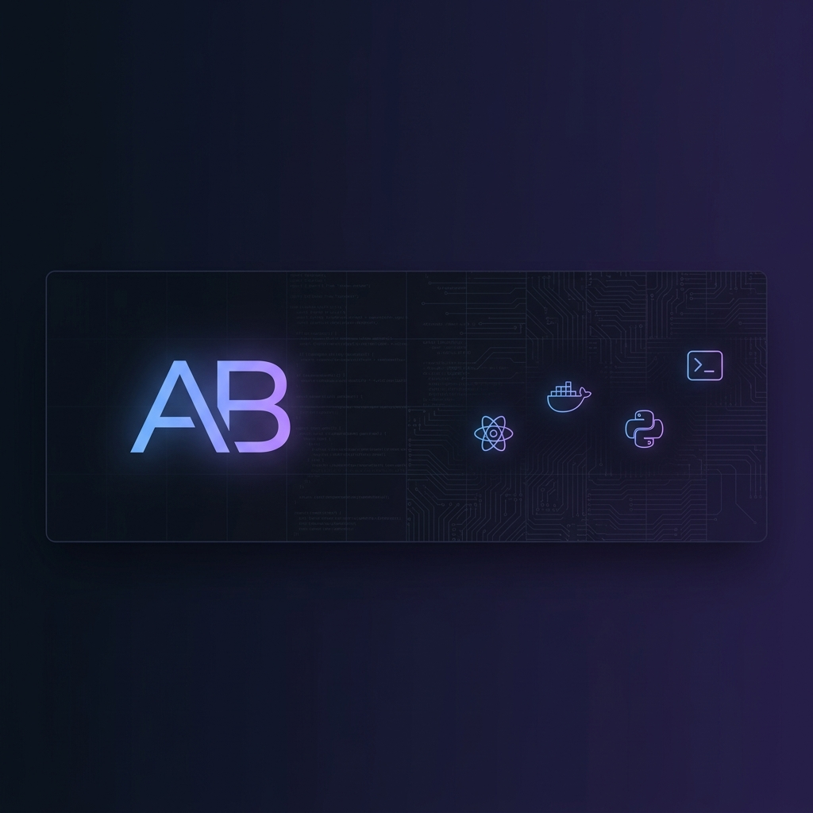

<!-- ═══════════════════════════════════════════════════════════════════ -->
<!-- BANNER -->
<!-- ═══════════════════════════════════════════════════════════════════ -->

<p align="center">
  
</p>

<!-- ═══════════════════════════════════════════════════════════════════ -->
<!-- HEADER — Typing Animation + Social Badges -->
<!-- ═══════════════════════════════════════════════════════════════════ -->

<h1 align="center">
  
</h1>

<p align="center">
  <em>Building full-stack applications from system calls to pixel-perfect UIs.</em>
</p>

<p align="center">
  <a href="https://linkedin.com/in/adil-bourji"></a>&nbsp;
  <a href="mailto:adilbourji@outlook.com"></a>&nbsp;
  <a href="https://github.com/adi7-x"></a>&nbsp;
  
</p>

---

<!-- ═══════════════════════════════════════════════════════════════════ -->
<!-- ABOUT ME -->
<!-- ═══════════════════════════════════════════════════════════════════ -->

## 🧑‍💻 About Me

```yaml
name:       Adil Bourji
location:   Casablanca, Morocco
education:  1337 Coding School (42 Network) — Common Core Graduate
level:      11.44
status:     Open to Full-Stack Internship / Junior roles
```

I'm a Software Engineering student at [1337 School](https://1337.ma/) — part of the global **42 Network** (acceptance rate < 5%).
I build full-stack web applications from scratch — from database schema design and REST API architecture to responsive, internationalized frontends. I'm passionate about creating software that **solves real problems for real users**.

- 🔭 Currently working on: **AI-driven optimization tools** & cinematic web experiences
- 🌱 Learning: **FastAPI, Redis, Cloud deployment (AWS/GCP)**
- 💬 Ask me about: **React, Django, PostgreSQL, Docker, 42 School**
- ⚡ Fun fact: I built a logistics platform before I knew I loved logistics

---

<!-- ═══════════════════════════════════════════════════════════════════ -->
<!-- TECH STACK — Using skill-icons for visual impact -->
<!-- ═══════════════════════════════════════════════════════════════════ -->

## 🛠️ Tech Stack

<table>
<tr>
<td align="center" width="50%">

### Languages
<p>
  
</p>

</td>
<td align="center" width="50%">

### Frameworks & Libraries
<p>
  
</p>

</td>
</tr>
<tr>
<td align="center">

### DevOps & Tools
<p>
  
</p>

</td>
<td align="center">

### Databases & Infrastructure
<p>
  
</p>

</td>
</tr>
</table>

---

<!-- ═══════════════════════════════════════════════════════════════════ -->
<!-- FEATURED PROJECTS — The showpieces -->
<!-- ═══════════════════════════════════════════════════════════════════ -->

## 🚀 Featured Projects

<table>
<tr>
<td width="50%">

### 🚌 [Fleetmark](https://github.com/adi7-x/FLEETMARK-Transcendence)
**Smart Transportation Platform** — Production-ready shuttle reservation system for 1337 School.

`Django` `React` `TypeScript` `PostgreSQL` `Docker`

- 🔐 42 OAuth + JWT + Role-based access (HashiCorp Vault)
- 🌍 Multi-language (AR/FR/EN) with full RTL support
- 📊 Admin dashboard with analytics (Recharts)
- 🐳 WAF (ModSecurity) + ELK Stack monitoring
- 👥 11 Docker containers · **42 ft_transcendence** · **125/100**

</td>
<td width="50%">

### 📱 [UM6P Flow](https://github.com/adi7-x/um6p-flow)
**Campus Life Super-App** — PWA for daily campus services: food, laundry, barber.

`React 19` `Fastify` `TypeScript` `PostgreSQL` `Redis`

- 📡 Real-time via WebSocket + Redis pub/sub
- 🔒 OTP auth with JWT rotation & RBAC
- 🏗️ Monorepo (Turborepo + pnpm)
- 📱 Installable PWA for mobile access
- 🗄️ 49 API endpoints across 6 modules

</td>
</tr>
</table>

---

<!-- ═══════════════════════════════════════════════════════════════════ -->
<!-- 42 COMMON CORE — The engineering foundation -->
<!-- ═══════════════════════════════════════════════════════════════════ -->

## 🎓 42 Common Core

Systems-level projects that built my engineering foundation at [1337 School](https://1337.ma/) (42 Network).

<table>
<tr>
<td align="center" width="14%">
  <a href="https://github.com/adi7-x/ft_irc">
    <br>
    <sub><b>IRC Server</b></sub><br>
    <sub>C++ · Sockets · poll()</sub>
  </a>
</td>
<td align="center" width="14%">
  <a href="https://github.com/adi7-x/Inception">
    <br>
    <sub><b>Docker</b></sub><br>
    <sub>Docker Compose</sub>
  </a>
</td>
<td align="center" width="14%">
  <a href="https://github.com/adi7-x/CPP_Modules">
    <br>
    <sub><b>C++ Modules</b></sub><br>
    <sub>OOP · STL · Templates</sub>
  </a>
</td>
<td align="center" width="14%">
  <a href="https://github.com/adi7-x/cub3D">
    <br>
    <sub><b>Raycaster</b></sub><br>
    <sub>C · miniLibX</sub>
  </a>
</td>
<td align="center" width="14%">
  <a href="https://github.com/adi7-x/minishell">
    <br>
    <sub><b>Shell</b></sub><br>
    <sub>C · Unix · Processes</sub>
  </a>
</td>
<td align="center" width="14%">
  <a href="https://github.com/adi7-x/philosopher">
    <br>
    <sub><b>Threads</b></sub><br>
    <sub>C · Mutexes</sub>
  </a>
</td>
</tr>
<tr>
<td align="center">
  <a href="https://github.com/adi7-x/netpractice">
    <br>
    <sub><b>Networking</b></sub><br>
    <sub>TCP/IP · Subnetting</sub>
  </a>
</td>
<td align="center">
  <a href="https://github.com/adi7-x/Push_swap">
    <br>
    <sub><b>Algorithms</b></sub><br>
    <sub>C · Sorting</sub>
  </a>
</td>
<td align="center">
  <a href="https://github.com/adi7-x/fract-ol">
    <br>
    <sub><b>Fractals</b></sub><br>
    <sub>C · Graphics</sub>
  </a>
</td>
<td align="center">
  <a href="https://github.com/adi7-x/Mini_Talk">
    <br>
    <sub><b>Signals</b></sub><br>
    <sub>C · IPC</sub>
  </a>
</td>
<td align="center">
  <a href="https://github.com/adi7-x/Born2beRoot">
    <br>
    <sub><b>SysAdmin</b></sub><br>
    <sub>Debian · LVM</sub>
  </a>
</td>
<td align="center">
  <a href="https://github.com/adi7-x/FT_PRINTF">
    <br>
    <sub><b>Printf</b></sub><br>
    <sub>C · Variadic</sub>
  </a>
</td>
</tr>
</table>

---

<!-- ═══════════════════════════════════════════════════════════════════ -->
<!-- GITHUB STATS — Dynamic cards -->
<!-- ═══════════════════════════════════════════════════════════════════ -->

## 📊 GitHub Stats

<p align="center">
  
  
</p>

<p align="center">
  
</p>

<!-- ═══════════════════════════════════════════════════════════════════ -->
<!-- CONTRIBUTION GRAPH — Activity visualization -->
<!-- ═══════════════════════════════════════════════════════════════════ -->

<p align="center">
  
</p>

---

<!-- ═══════════════════════════════════════════════════════════════════ -->
<!-- SNAKE ANIMATION -->
<!-- ═══════════════════════════════════════════════════════════════════ -->

<p align="center">
  <picture>
    <source media="(prefers-color-scheme: dark)" srcset="https://raw.githubusercontent.com/adi7-x/adi7-x/output/github-snake-dark.svg" />
    <source media="(prefers-color-scheme: light)" srcset="https://raw.githubusercontent.com/adi7-x/adi7-x/output/github-snake.svg" />
    
  </picture>
</p>

---

<!-- ═══════════════════════════════════════════════════════════════════ -->
<!-- FOOTER -->
<!-- ═══════════════════════════════════════════════════════════════════ -->

<p align="center">
  
</p>

<p align="center">
  <sub>
    <em>"The best way to predict the future is to build it."</em>
    <br><br>
    <b>Adil Bourji</b> · Software Engineer · 1337 Coding School (42 Network) · Casablanca, Morocco
  </sub>
</p>
